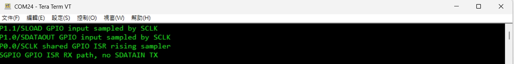
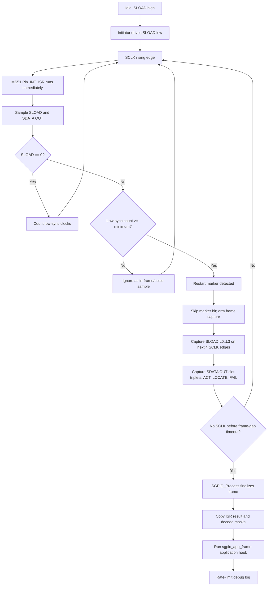
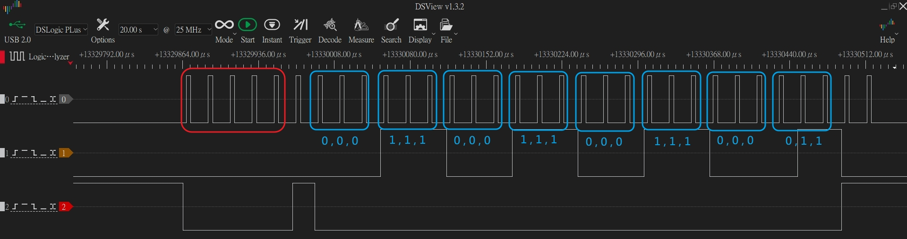
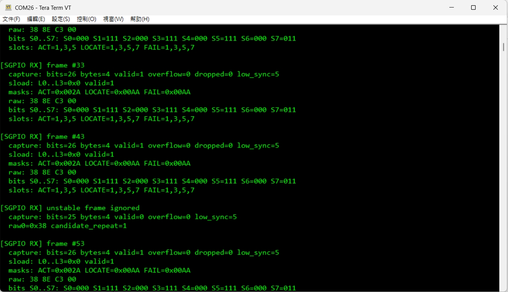

# MS51_Software_SGPIO

MS51 SGPIO target/slave example for validating SGPIO initiator traffic.

Update: `2026/06/25`

## Overview

- MCU / Series: `MS51`
- Device: `MS51FB9AE`
- Toolchain: `Keil uVision5`
- Purpose:
  - Capture SGPIO frames from an external SGPIO initiator/master.
  - Decode `SLOAD L0..L3 Raw` and `SDataOut` per-slot `ACT / LOCATE / FAIL` bits.
  - Keep SGPIO RX processing interrupt-driven and non-blocking so the heartbeat LED and main loop keep running.

## Hardware

- Debug UART:
  - `UART0`
  - `P0.6 = UART0_TXD`
  - `P0.7 = UART0_RXD`
  - Terminal setting: `115200 8N1`
- Heartbeat LED:
  - `P1.2`
  - Toggles from the Timer0 1 ms tick; if it stops, SGPIO handling is blocking the main loop or IRQ path.
- Main peripheral(s):
  - SGPIO target/slave receive path implemented by the MS51 pin interrupt ISR.
  - Capture is based on SCLK-synchronous GPIO sampling.
  - No `SDATA IN` target-to-initiator transmit path is implemented in this stage.
- Test equipment:
  - External SGPIO initiator/master.
  - Logic analyzer for `SCLK`, `SLOAD`, and `SDATA OUT`.

## Pin Map

| Function | Pin | Direction | Note |
| --- | --- | --- | --- |
| `UART0_RXD` | `P0.7` | Input | Debug UART RX |
| `UART0_TXD` | `P0.6` | Output | Debug UART TX |
| `HEARTBEAT_LED` | `P1.2` | Output | Toggles while main loop is alive |
| `SGPIO_SCLK` | `P0.0` | Input | Pin interrupt rising-edge sampler |
| `SGPIO_SDATAOUT` | `P1.0` | Input | Sampled by `SCLK` |
| `SGPIO_SLOAD` | `P1.1` | Input | Sampled by `SCLK`; no SLOAD interrupt is enabled |
| `GND` | `GND` | Ground | Common ground with SGPIO initiator |

The MS51 SGPIO pin map is centralized in [`Sample_Code/Template/Project/sgpio_slave.h`](Sample_Code/Template/Project/sgpio_slave.h). When changing GPIO pins, update the related `SGPIO_SLAVE_*` pin mask, IO read, input-mode, interrupt, and pin-name macros together.

External SGPIO wiring:

| Initiator signal | Direction into MS51 | MS51 pin |
| --- | --- | --- |
| `SCLK` | Input clock | `P0.0 GPIO input` |
| `SDATA OUT` | Input data | `P1.0 GPIO input` |
| `SLOAD` | Input frame marker | `P1.1 GPIO input` |
| `GND` | Common reference | `GND` |

## Build Environment

- BSP / SDK: Nuvoton MS51 8051 BSP / local `Library`.
- IDE / compiler: Keil uVision5 project.
- Project file: [`Sample_Code/Template/Project/KEIL/Project_temp.uvproj`](Sample_Code/Template/Project/KEIL/Project_temp.uvproj)
- Target: `Project_temp`
- Main source path: [`Sample_Code/Template/Project`](Sample_Code/Template/Project)
- Output image: `Sample_Code/Template/Project/KEIL/Output/`.

## Project Layout

- [`Sample_Code/Template/Project/main.c`](Sample_Code/Template/Project/main.c)
  - System init, UART0 init, Timer0 1 ms tick, heartbeat LED, pin interrupt vector, and calls to `SGPIO_Init()` / `SGPIO_Process()`.
- [`Sample_Code/Template/Project/sgpio_slave.c`](Sample_Code/Template/Project/sgpio_slave.c)
  - MS51 pin interrupt SGPIO receiver, frame capture, decode, stability filter, application hook, and debug log.
- [`Sample_Code/Template/Project/sgpio_slave.h`](Sample_Code/Template/Project/sgpio_slave.h)
  - MS51 SGPIO pin macros and public API.
- [`Sample_Code/Template/Project/misc_config.c`](Sample_Code/Template/Project/misc_config.c)
  - Common timing and helper utilities used by the template project.

## Firmware Behavior

### Power-on

Expected boot log includes the SGPIO pin-role messages:

```text
P1.1/SLOAD GPIO input sampled by SCLK
P1.0/SDATAOUT GPIO input sampled by SCLK
P0.0/SCLK shared GPIO ISR rising sampler
SGPIO GPIO ISR RX path, no SDATAIN TX
```

Reference power-on log:



### Main Loop

The main loop must remain lightweight:

1. `SGPIO_Process()` finalizes completed frames, copies the ISR-built result, decodes it, runs application behavior, and prints rate-limited logs.
2. The Timer0 1 ms tick drives the 1 second heartbeat flag.
3. `P1.2` toggles while the main loop is alive.
4. SGPIO bit capture is not done in the polling loop.
5. `printf()` must not be called from the SGPIO ISR.

### Application Hook

Accepted SGPIO frames are copied into `local_frame`, decoded into `act_mask / locate_mask / fail_mask`, and then passed to the application hook:

```c
sgpio_app_frame(&local_frame);
```

`sgpio_app_frame()` walks each valid slot and calls `sgpio_app_slot(slot, act, locate, fail)`. `sgpio_app_slot()` is the intended place to add product behavior with a slot-based `switch` statement.

Example use:

```c
case 0U:
    if (act != 0U)
    {
        /* Slot 0 ACT asserted: set the expected device/GPIO/LED state here. */
    }
    if (locate != 0U)
    {
        /* Slot 0 LOCATE asserted: set the expected device/GPIO/LED state here. */
    }
    if (fail != 0U)
    {
        /* Slot 0 FAIL asserted: set the expected device/GPIO/LED state here. */
    }
    break;
```

The application hook runs after a stable frame is accepted and is intentionally outside the debug `printf()` rate limit. Keep hook code non-blocking. Prefer setting outputs to the decoded state instead of toggling on every repeated SGPIO frame, unless repeated toggling is the intended behavior.

### SGPIO Signal Handling Flow

The current receiver uses `P0.0/SCLK` as the only active SGPIO receive interrupt.

1. `SLOAD` is normally high before a frame.
2. The SGPIO initiator drives `SLOAD` low for the low-sync run.
3. On every `P0.0/SCLK` rising edge, the MS51 pin interrupt ISR runs.
4. At ISR entry, firmware immediately samples:
   - `P1.1/SLOAD`
   - `P1.0/SDATA OUT`
5. `SGPIO_OnClockRisingSampledIrq(sload_sample, sdata_sample)` updates the in-RAM capture state.
6. While `SLOAD=0`, the receiver counts low-sync clocks.
7. After at least `SGPIO_LOW_SYNC_MIN_BITS` low clocks, a `SLOAD=1` sample on a `P0.0/SCLK` rising edge is treated as the restart marker.
8. The restart-marker clock is not stored as slot data.
9. The next four `P0.0/SCLK` rising edges provide `SLOAD L0..L3 Raw`.
10. `SDATA OUT` slot bits start immediately after the marker and are captured in parallel with the `L0..L3` clocks.
11. Each slot consumes three `SDATA OUT` bits in this order:
    - bit 0: `ACT`
    - bit 1: `LOCATE`
    - bit 2: `FAIL`
12. `SGPIO_Process()` finalizes the frame after `SGPIO_FRAME_GAP_TIMEOUT_MS` with no new `P0.0/SCLK` edge, then decodes and logs the result.



Important ISR rule:

- `Pin_INT_ISR()` is the MS51 pin interrupt vector at `0x3B` and calls `SGPIO_PinInterruptHandler()`.
- `SGPIO_PinInterruptHandler()` must check `SGPIO_SLAVE_SCLK_INT_PENDING` before any future unrelated pin interrupt handling.
- Any future unrelated pin interrupt handling must be added below the `P0.0/SCLK` block so SGPIO sampling is not delayed.
- `SLOAD` falling/rising edges do not create frame events by themselves in this implementation.
- `SLOAD` is only meaningful when sampled at `P0.0/SCLK` rising edge.
- This avoids treating in-frame `SLOAD L0..L3` transitions as false frame starts.

## Raw Bit Decode

Raw SGPIO bytes are printed in capture order and decoded __LSB-first__.

For a raw byte:

```text
raw byte = 0x38
binary   = 0011 1000  (normal MSB-left display)
LSB bits = bit0..bit7 = 0,0,0,1,1,1,0,0
```

The SGPIO decoder consumes the __LSB__ bit stream:

```text
bit index = byte_index * 8 + bit_in_byte
bit value = (raw[byte_index] >> bit_in_byte) & 0x01
```

Slot mapping:

```text
Slot N ACT    = bit (N * 3 + 0)
Slot N LOCATE = bit (N * 3 + 1)
Slot N FAIL   = bit (N * 3 + 2)
```

SFF-8485 OD bit position mapping:

- `ODx.y` is the SFF-8485 SDataOut bit position name.
- `x` is the slot / drive index.
- `y` is the bit index inside that slot triplet.
- Current decoder semantics map `ODx.0 -> ACT`, `ODx.1 -> LOCATE`, and `ODx.2 -> FAIL`.

| SFF-8485 bit | Raw bit index | Raw byte.bit | Current semantic | Mask bit |
| --- | ---: | --- | --- | ---: |
| `OD0.0` | 0 | `raw[0].bit0` | `Slot 0 ACT` | 0 |
| `OD0.1` | 1 | `raw[0].bit1` | `Slot 0 LOCATE` | 0 |
| `OD0.2` | 2 | `raw[0].bit2` | `Slot 0 FAIL` | 0 |
| `OD1.0` | 3 | `raw[0].bit3` | `Slot 1 ACT` | 1 |
| `OD1.1` | 4 | `raw[0].bit4` | `Slot 1 LOCATE` | 1 |
| `OD1.2` | 5 | `raw[0].bit5` | `Slot 1 FAIL` | 1 |
| `OD2.0` | 6 | `raw[0].bit6` | `Slot 2 ACT` | 2 |
| `OD2.1` | 7 | `raw[0].bit7` | `Slot 2 LOCATE` | 2 |
| `OD2.2` | 8 | `raw[1].bit0` | `Slot 2 FAIL` | 2 |
| `OD3.0` | 9 | `raw[1].bit1` | `Slot 3 ACT` | 3 |
| `OD3.1` | 10 | `raw[1].bit2` | `Slot 3 LOCATE` | 3 |
| `OD3.2` | 11 | `raw[1].bit3` | `Slot 3 FAIL` | 3 |
| `OD4.0` | 12 | `raw[1].bit4` | `Slot 4 ACT` | 4 |
| `OD4.1` | 13 | `raw[1].bit5` | `Slot 4 LOCATE` | 4 |
| `OD4.2` | 14 | `raw[1].bit6` | `Slot 4 FAIL` | 4 |
| `OD5.0` | 15 | `raw[1].bit7` | `Slot 5 ACT` | 5 |
| `OD5.1` | 16 | `raw[2].bit0` | `Slot 5 LOCATE` | 5 |
| `OD5.2` | 17 | `raw[2].bit1` | `Slot 5 FAIL` | 5 |
| `OD6.0` | 18 | `raw[2].bit2` | `Slot 6 ACT` | 6 |
| `OD6.1` | 19 | `raw[2].bit3` | `Slot 6 LOCATE` | 6 |
| `OD6.2` | 20 | `raw[2].bit4` | `Slot 6 FAIL` | 6 |
| `OD7.0` | 21 | `raw[2].bit5` | `Slot 7 ACT` | 7 |
| `OD7.1` | 22 | `raw[2].bit6` | `Slot 7 LOCATE` | 7 |
| `OD7.2` | 23 | `raw[2].bit7` | `Slot 7 FAIL` | 7 |
| `OD8.0` | 24 | `raw[3].bit0` | `Slot 8 ACT` | 8 |
| `OD8.1` | 25 | `raw[3].bit1` | `Slot 8 LOCATE` | 8 |
| `OD8.2` | 26 | `raw[3].bit2` | `Slot 8 FAIL` | 8 |
| `OD9.0` | 27 | `raw[3].bit3` | `Slot 9 ACT` | 9 |
| `OD9.1` | 28 | `raw[3].bit4` | `Slot 9 LOCATE` | 9 |
| `OD9.2` | 29 | `raw[3].bit5` | `Slot 9 FAIL` | 9 |
| `OD10.0` | 30 | `raw[3].bit6` | `Slot 10 ACT` | 10 |
| `OD10.1` | 31 | `raw[3].bit7` | `Slot 10 LOCATE` | 10 |
| `OD10.2` | 32 | `raw[4].bit0` | `Slot 10 FAIL` | 10 |
| `OD11.0` | 33 | `raw[4].bit1` | `Slot 11 ACT` | 11 |
| `OD11.1` | 34 | `raw[4].bit2` | `Slot 11 LOCATE` | 11 |
| `OD11.2` | 35 | `raw[4].bit3` | `Slot 11 FAIL` | 11 |
| `OD12.0` | 36 | `raw[4].bit4` | `Slot 12 ACT` | 12 |
| `OD12.1` | 37 | `raw[4].bit5` | `Slot 12 LOCATE` | 12 |
| `OD12.2` | 38 | `raw[4].bit6` | `Slot 12 FAIL` | 12 |
| `OD13.0` | 39 | `raw[4].bit7` | `Slot 13 ACT` | 13 |
| `OD13.1` | 40 | `raw[5].bit0` | `Slot 13 LOCATE` | 13 |
| `OD13.2` | 41 | `raw[5].bit1` | `Slot 13 FAIL` | 13 |
| `OD14.0` | 42 | `raw[5].bit2` | `Slot 14 ACT` | 14 |
| `OD14.1` | 43 | `raw[5].bit3` | `Slot 14 LOCATE` | 14 |
| `OD14.2` | 44 | `raw[5].bit4` | `Slot 14 FAIL` | 14 |
| `OD15.0` | 45 | `raw[5].bit5` | `Slot 15 ACT` | 15 |
| `OD15.1` | 46 | `raw[5].bit6` | `Slot 15 LOCATE` | 15 |
| `OD15.2` | 47 | `raw[5].bit7` | `Slot 15 FAIL` | 15 |

Example:

```text
raw: 38 8E C3 00

0x38 LSB bits: 0 0 0 1 1 1 0 0
0x8E LSB bits: 0 1 1 1 0 0 0 1
0xC3 LSB bits: 1 1 0 0 0 0 1 1
0x00 LSB bits: 0 0 0 0 0 0 0 0
```

Grouped by slot triplets:

```text
S0=000
S1=111
S2=000
S3=111
S4=000
S5=111
S6=000
S7=011
```

In each `Sx=abc` triplet:

- `a = ACT`
- `b = LOCATE`
- `c = FAIL`

The log also prints mask form:

```text
masks: ACT=0x002A LOCATE=0x00AA FAIL=0x00AA
slots: ACT=1,3,5 LOCATE=1,3,5,7 FAIL=1,3,5,7
```

Mask bit meaning:

- bit 0 = Slot 0
- bit 1 = Slot 1
- bit 2 = Slot 2
- and so on

## Captured Decode Examples

Logic analyzer channels used by the captured examples:

- `CH0 : SCLOCK`
- `CH1 : SDATA OUT`
- `CH2 : SLOAD`

MS51 GPIO mapping for those captures:

- `SCLOCK` maps to `P0.0/SCLK`.
- `SDATA OUT` maps to `P1.0/SDATA OUT`.
- `SLOAD` maps to `P1.1/SLOAD`.

Decode rule reminder:

- `SLOAD` low run plus a sampled `SLOAD=1` restart marker defines the frame boundary.
- `SDATA OUT` is sampled on every `SCLK` rising edge after the restart marker.
- Each slot is decoded as a 3-bit triplet: `Sx=ACT,LOCATE,FAIL`.
- Raw bytes are decoded LSB-first, so `raw: 38 8E C3 00` does not read like a normal MSB-left binary string.

| Example | Raw bytes | Slot triplets | Masks | Decoded active slots |
| --- | --- | --- | --- | --- |
| 8-slot alternating | `38 8E C3 00` | `S0=000 S1=111 S2=000 S3=111 S4=000 S5=111 S6=000 S7=011` | `ACT=0x002A LOCATE=0x00AA FAIL=0x00AA` | `ACT=1,3,5`, `LOCATE=1,3,5,7`, `FAIL=1,3,5,7` |
| 8-slot mixed | `78 9C 24 00` | `S0=000 S1=111 S2=100 S3=011 S4=100 S5=100 S6=100 S7=100` | `ACT=0x00F6 LOCATE=0x000A FAIL=0x000A` | `ACT=1,2,4,5,6,7`, `LOCATE=1,3`, `FAIL=1,3` |
| 16-slot repeating | `11 15 51 11 15 51` | `S0=100 S1=010 S2=001 S3=010 S4=100 S5=010 S6=001 S7=010`, `S8=100 S9=010 S10=001 S11=010 S12=100 S13=010 S14=001 S15=010` | `ACT=0x1111 LOCATE=0xAAAA FAIL=0x4444` | `ACT=0,4,8,12`, `LOCATE=1,3,5,7,9,11,13,15`, `FAIL=2,6,10,14` |

### Example: `38 8E C3 00`

The LA annotation groups `SDATA OUT` bits into slot triplets after the SLOAD restart marker. The UART log confirms the same raw bytes, triplets, masks, and slot list.






### Example: `78 9C 24 00`

This example verifies that mixed slot states are not limited to all-on/all-off patterns. Slot 2 and slots 4 through 7 assert only `ACT`, while slots 1 and 3 assert all three signals differently according to the triplet values.


### Example: `11 15 51 11 15 51`

This is a full 16-slot capture. The log prints `S0..S7` and `S8..S15` separately so the 48-bit SDataOut stream can be checked without wrapping into an unreadable single line.


## Configuration

Main config files:

- [`Sample_Code/Template/Project/sgpio_slave.h`](Sample_Code/Template/Project/sgpio_slave.h)
- [`Sample_Code/Template/Project/sgpio_slave.c`](Sample_Code/Template/Project/sgpio_slave.c)

Important public pin macros:

```c
#define SGPIO_SLAVE_SCLK_PIN_MASK       (0x01U)
#define SGPIO_SLAVE_SDOUT_PIN_MASK      (0x01U)
#define SGPIO_SLAVE_SLOAD_PIN_MASK      (0x02U)

#define SGPIO_SLAVE_SCLK_IO             ((uint8_t)((P00 != 0U) ? 1U : 0U))
#define SGPIO_SLAVE_SDOUT_IO            ((uint8_t)((P10 != 0U) ? 1U : 0U))
#define SGPIO_SLAVE_SLOAD_IO            ((uint8_t)((P11 != 0U) ? 1U : 0U))

#define SGPIO_SLAVE_SCLK_INPUT_MODE     P00_INPUT_MODE
#define SGPIO_SLAVE_SDOUT_INPUT_MODE    P10_INPUT_MODE
#define SGPIO_SLAVE_SLOAD_INPUT_MODE    P11_INPUT_MODE

#define SGPIO_SLAVE_SELECT_INT_PORT     clr_PICON_PIPS1; clr_PICON_PIPS0
#define SGPIO_SLAVE_ENABLE_SCLK_TRIG    ENABLE_BIT0_RISINGEDGE_TRIG
#define SGPIO_SLAVE_CLEAR_SCLK_INT_FLAG CLEAR_PIN_INTERRUPT_PIT0_FLAG
#define SGPIO_SLAVE_SCLK_INT_PENDING    ((PIF & SGPIO_SLAVE_SCLK_PIN_MASK) != 0U)

#define SGPIO_SLAVE_SLOAD_PIN_NAME      "P1.1"
#define SGPIO_SLAVE_SDOUT_PIN_NAME      "P1.0"
#define SGPIO_SLAVE_SCLK_PIN_NAME       "P0.0"

#define SGPIO_SLAVE_MAX_SLOTS           (16U)
#define SGPIO_SLAVE_RX_MAX_BYTES        (8U)
```

When moving SGPIO to other GPIO pins, update all related macros in the same group:

- pin mask macros used by interrupt flag checks.
- IO read macros used by the ISR sampler.
- input mode macros used by `SGPIO_Init()`.
- pin interrupt select, trigger, clear, and pending macros used by `SGPIO_PinInterruptHandler()`.
- pin-name macros used by the boot log.

Important internal timing/filter macros:

```c
#define SGPIO_LOW_SYNC_MIN_BITS             (5U)
#define SGPIO_SLOAD_RAW_BITS                (4U)
#define SGPIO_DATA_BITS_PER_SLOT            (3U)
#define SGPIO_FRAME_GAP_TIMEOUT_MS          (5UL)
#define SGPIO_FRAME_ARM_TIMEOUT_MS          (20UL)
#define SGPIO_FRAME_LOG_FIRST_N             (1UL)
#define SGPIO_FRAME_LOG_MIN_INTERVAL_MS     (1000UL)
#define SGPIO_FRAME_STABLE_REQUIRED         (2U)
#define SGPIO_UNSTABLE_LOG_MIN_INTERVAL_MS  (3000UL)
```

## Test Flow

1. Connect the SGPIO initiator `SCLK/SDATA OUT/SLOAD/GND` to MS51 `P0.0/P1.0/P1.1/GND`.
2. Open a UART terminal on MS51 `UART0`, `115200 8N1`.
3. Power on or reset MS51.
4. Confirm the SGPIO startup log appears.
5. Confirm `P1.2` heartbeat LED continues toggling.
6. Drive a valid SGPIO frame from the initiator.
7. Confirm the MS51 UART log decodes the expected masks and slot list.
8. If frames are unstable, lower initiator `SCLK`, shorten wiring, and confirm the waveform with a logic analyzer.

## Validation

UART log should show valid frames such as:

```text
[SGPIO RX] frame #N
  capture: bits=26 bytes=4 valid=1 overflow=0 dropped=0 low_sync=5
  sload: L0..L3=0x0 valid=1
  masks: ACT=0x002A LOCATE=0x00AA FAIL=0x00AA
  raw: 38 8E C3 00
  bits: S0=000 S1=111 S2=000 S3=111 S4=000 S5=111 S6=000 S7=011
  slots: ACT=1,3,5 LOCATE=1,3,5,7 FAIL=1,3,5,7
```

External initiator result:

- Changing the initiator slot pattern should change MS51 `ACT / LOCATE / FAIL` masks.

Scope / logic analyzer:

- `SLOAD` idles high between frames.
- A frame starts after `SLOAD` stays low for at least five `SCLK` rising edges.
- A sampled `SLOAD=1` on `SCLK` rising edge marks the restart marker.
- `SDATA OUT` must be stable around each `SCLK` rising edge.

## Troubleshooting

- If `P1.2` heartbeat stops:
  - Check for excessive `printf()` output.
  - Keep SGPIO debug log rate-limited.
  - Confirm no busy-wait or FIFO-drain loop was reintroduced into `SGPIO_Process()`.
- If logs show frequent `unstable frame ignored`:
  - Lower the initiator `SCLK`.
  - Check common GND and wire length.
  - Capture `SCLK`, `SLOAD`, and `SDATA OUT` with a logic analyzer.
- If decoded slots are shifted:
  - Confirm `SLOAD` low-sync and restart marker are visible.
  - Confirm data is interpreted LSB-first.
  - Confirm slot order is `ACT`, `LOCATE`, `FAIL`.
- If `valid=0` or `bits` is unexpected:
  - Check whether the frame ended too early or too late.
  - Review `SGPIO_FRAME_GAP_TIMEOUT_MS`.
  - Confirm the initiator slot count matches the intended test.

## Notes

- This implementation is RX-only for the MS51 target.
- `SDATA IN` target-to-initiator transmit is intentionally not implemented yet.
- `P1.0` remains a plain GPIO input; `SDATA OUT` is sampled only by the `P0.0/SCLK` rising ISR.
- `P1.1/SLOAD` interrupt is not enabled; `SLOAD` is sampled only by the `P0.0/SCLK` rising ISR.
- `P0.0/SCLK` is the only SGPIO pin interrupt source in this implementation.
- Keep `SGPIO_Process()` non-blocking. It should finalize/copy/decode/print only.
- Keep `sgpio_app_frame()` and `sgpio_app_slot()` non-blocking. Use them for slot `ACT / LOCATE / FAIL` application behavior after stable frame decode.
- Keep capture ownership in the `SCLK` rising-edge sampling path unless the timing model is re-evaluated.

## Related Files

- [`Sample_Code/Template/Project/main.c`](Sample_Code/Template/Project/main.c)
- [`Sample_Code/Template/Project/sgpio_slave.c`](Sample_Code/Template/Project/sgpio_slave.c)
- [`Sample_Code/Template/Project/sgpio_slave.h`](Sample_Code/Template/Project/sgpio_slave.h)
- [`Sample_Code/Template/Project/KEIL/Project_temp.uvproj`](Sample_Code/Template/Project/KEIL/Project_temp.uvproj)

## Reference Specifications

- SFF-8485: Serial GPIO bus framing and signal timing.
- SFF-8489: IBPI interpretation for drive slot indicators.

## Revision

- `2026/06/25`: updated README for MS51FB9AE, `P0.0/P1.0/P1.1` SGPIO wiring, MS51 pin interrupt flow, and current Keil project paths.
